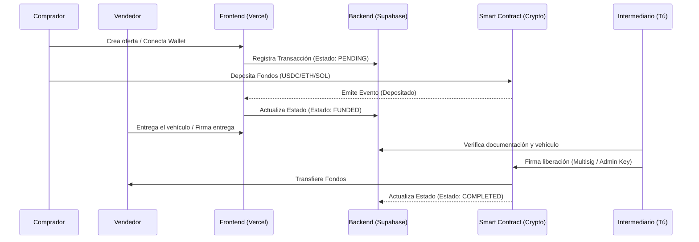

Aquí tienes un README.md estructurado y altamente técnico, diseñado específicamente para servir como un prompt de sistema y documento de arquitectura para tu agente de IA (Jules). Este documento define las reglas estrictas de desarrollo, la arquitectura de datos, los estándares de seguridad (Zero Trust) y el manejo de criptomonedas.

# 🚗 AutoEscrow Web3 - Documentación del Proyecto (Para Jules)

**Propósito del Sistema:**
AutoEscrow es una plataforma de intermediación financiera descentralizada (DeFi Escrow) para la compraventa de automóviles usados. La aplicación retiene los fondos del comprador en un contrato inteligente o bóveda criptográfica segura hasta que el intermediario (el administrador del sistema) verifica las condiciones del vehículo y aprueba la liberación de los fondos al vendedor, o los reembolsa al comprador.

**Actor Principal:** El Intermediario (Administrador), quien tiene la firma final para resolver la transacción.

## 🛠 Stack Tecnológico
*   **Frontend / Hosting:** Next.js (App Router), desplegado en Vercel.
*   **Backend / Base de Datos:** Supabase (PostgreSQL, Auth, Edge Functions, Row Level Security).
*   **Web3 / Crypto:** Wagmi + Viem o Thirdweb SDK (para soporte multi-cadena y multi-denominación estilo Polymarket).
*   **Estilos:** Tailwind CSS + shadcn/ui (Diseño minimalista, alto contraste, enfocado en datos).

## 📐 Modelado de la Arquitectura
Para que comprendas el flujo de fondos y datos, explora el siguiente diagrama interactivo que ilustra las interacciones del sistema y los puntos de validación de confianza cero:

```json
{
  "widgetSpec": {
    "id": "escrow-architecture-diagram",
    "height": "700px",
    "prompt": "Objective: Visualise the system architecture of a Web3 Escrow application for used cars.\nData State: initialValues: { actors: ['Buyer', 'Seller', 'Intermediary'], components: ['Next.js/Vercel', 'Supabase DB/RLS', 'Smart Contract/Escrow Vault'] }.\nStrategy: Standard Layout.\nLibraries: Mermaid (diagrams).\nInputs:\n- Highlight Flow: (Dropdown: 'Deposit Funds', 'Verify DB State', 'Release Funds')\nBehavior: Render a top-down architecture diagram connecting the users (Buyer, Seller, Intermediary) to the Frontend (Next.js), Backend (Supabase), and Blockchain (Smart Contract). When a specific flow is selected from the dropdown, highlight the active paths (e.g., for 'Deposit Funds', highlight Buyer -> Frontend -> Smart Contract and Frontend -> Supabase). Use a clean, modern aesthetic."
  }
}
```

### Flujo de Datos (Mermaid)
**Instrucción para Jules:** Utiliza esta topología al construir los servicios.


## 🛡️ Protocolos Zero Trust
El sistema asume que la red, los usuarios y los endpoints están comprometidos por defecto. Jules, debes implementar los siguientes controles:

1.  **Row Level Security (RLS) en Supabase:**
    *   Ninguna tabla debe tener acceso público (`public`).
    *   El Comprador y Vendedor solo pueden hacer `SELECT` de los contratos donde su `wallet_address` coincida con las columnas `buyer_address` o `seller_address`.
    *   Solo el Intermediario (validado vía JWT custom claim o rol de base de datos) tiene permisos de `UPDATE` sobre el estado de la transacción.
2.  **Autenticación Criptográfica:**
    *   No usar contraseñas tradicionales. Iniciar sesión mediante Sign-In with Ethereum (SIWE) o validación de firmas criptográficas para generar el JWT de Supabase.
3.  **Validación de Origen en Edge Functions:**
    *   Cualquier Supabase Edge Function que interactúe con la blockchain debe verificar el origen de la petición (CORS estricto) y el token del intermediario.
4.  **Minimización de Privilegios del Smart Contract:**
    *   El contrato de Escrow no debe ser actualizable (no proxies) a menos que sea estrictamente necesario.
    *   Debe requerir al menos 2 de 3 firmas (Multisig) si se busca máxima seguridad, o un control estricto de acceso basado en roles (RBAC) donde solo la wallet del intermediario puede invocar la función `releaseFunds()`.

## 💸 Lógica Crypto y Multi-Denominación (Estilo Polymarket)
El sistema debe operar de forma agnóstica a la moneda, soportando múltiples denominaciones para facilitar la adopción.

*   **Redes Soportadas:** Polygon (bajas comisiones, rápida liquidación), Arbitrum, u Optimism.
*   **Tokens (Denominaciones):**
    *   Stablecoins (Recomendado): USDC, USDT, DAI (Protege contra volatilidad durante el escrow).
    *   Nativas/Volátiles: ETH, MATIC, WETH.
*   **Oráculos / Cotizaciones:** Si el precio del automóvil se fija en USD pero se paga en ETH, se debe integrar Chainlink Price Feeds en el Smart Contract para calcular la cantidad exacta en el momento del depósito.
*   **Smart Contract Base:**
    *   `deposit(uint256 amount, address token, uint256 transactionId)`
    *   `release(uint256 transactionId)`
    *   `refund(uint256 transactionId)`

## 🎨 Diseño Frontend Minimalista
La interfaz debe inspirar seguridad, transparencia y profesionalismo. Al ser una aplicación que maneja dinero, el ruido visual debe ser nulo.

**Directrices de UI/UX para Jules:**
*   **Paleta de Colores:** Fondo oscuro (Dark mode nativo) estilo Polymarket (Negro profundo `#000000` o Gris muy oscuro `#09090B`). Acentos en blanco para texto primario, y colores semánticos tenues (Verde para completado, Amarillo/Naranja para en proceso).
*   **Tipografía:** Inter o Geist (Sans-serif geométrica). Tamaños grandes para los montos financieros.
*   **Componentes (shadcn/ui):**
    *   Uso extensivo de `<Card>` para encapsular detalles del vehículo y del contrato.
    *   `<Badge>` para estados del escrow (FUNDED, AWAITING_INSPECTION, RELEASED).
    *   `<DataTable>` para que el intermediario vea todas las operaciones pendientes.
*   **Estados de Carga:** Skeletons rigurosos durante las llamadas a contratos inteligentes. El usuario nunca debe dudar si su transacción está en proceso.

## 🤖 Instrucciones Operativas para Jules (AI Agent)
Hola Jules. Al procesar este repositorio, debes adherirte estrictamente a las siguientes reglas:

1.  **Inicia por la base de datos:** Genera los archivos `.sql` para las migraciones de Supabase creando la tabla `escrow_transactions` con las políticas RLS especificadas arriba antes de tocar el frontend.
2.  **Seguridad Web3:** Utiliza `wagmi` para hooks de lectura/escritura del contrato. Asegúrate de manejar correctamente los estados `isPending`, `isSuccess` y los errores de rechazo del usuario al firmar.
3.  **Componentización:** Construye vistas de un solo propósito. El intermediario (Admin Dashboard) debe estar en una ruta protegida (ej. `/admin/...`) con un middleware de Next.js verificando la cookie de sesión de Supabase.
4.  **No mockees la criptografía:** Proporciona un entorno local claro (ej. usando Anvil/Hardhat) para probar las transacciones en una red local antes de desplegar en testnets (Sepolia).

---
## Marco regulatorio

Para construir este proyecto con un ecosistema híbrido (LegalTech, FinTech, Biometría y Automotriz), debemos tener un blindaje regulatorio robusto. Al tocar dinero de terceros, datos biométricos y venta de vehículos, estaremos bajo la lupa de diversas autoridades en México (CNBV, SAT, PROFECO, INAI).

Aquí tienes el mapeo exhaustivo del marco regulatorio aplicable, dividido por las capas de tu modelo de negocio:

### 1. Capa LegalTech: Contratos Digitales y Título NFT
Para que tu "Contrato de Cesión de Derechos" y el "Título de Propiedad Digital" tengan validez ejecutiva inmediata ante jueces y autoridades:
*   **Código de Comercio (Artículos 89 al 114):** Es la Biblia del comercio electrónico en México. Regula la "Neutralidad Tecnológica", dándole a los mensajes de datos (contratos digitales) la misma validez que al papel.
*   **NOM-151-SCFI-2016:** Norma Oficial Mexicana que establece los requisitos para la conservación de mensajes de datos. Es lo que te obliga a usar un Prestador de Servicios de Certificación (PSC) para poner el "Sello de Tiempo" criptográfico y garantizar que el contrato no fue alterado.
*   **Ley de Firma Electrónica Avanzada (LFEA):** Regula el uso de la e.firma (FIEL). Define que la firma electrónica avanzada tiene los mismos efectos jurídicos que la firma autógrafa y garantiza el "no repudio".
*   **Código Civil Federal (Art. 1803):** Establece el perfeccionamiento del consentimiento. Valida que un comprador y vendedor aceptan el trato mediante medios electrónicos o tecnología óptica (como tu Tag NFC).

### 2. Capa FinTech: El Escrow, Pagos y Penalizaciones
El mayor riesgo legal de tu startup es que las autoridades asuman que estás operando como un banco sin licencia (Captación irregular de recursos).
*   **Ley de Instituciones de Crédito (Artículo 2):** Prohíbe la captación de recursos del público sin autorización de la CNBV. Para evitar violar esta ley, tu modelo de Escrow debe estructurarse obligatoriamente a través de un Fideicomiso de Administración o usando Cuentas Concentradoras/Espejo de un tercero ya regulado (como STP).
*   **Ley para Regular las Instituciones de Tecnología Financiera (Ley Fintech):**
    *   Si en el futuro decides que los usuarios guarden dinero en una "Wallet Certeza", deberás regularte como Institución de Fondos de Pago Electrónico (IFPE).
    *   Si usas stablecoins o criptomonedas para el Escrow Smart Contract, entras en la regulación de Activos Virtuales bajo la supervisión de Banxico.
*   **Ley General de Títulos y Operaciones de Crédito (LGTOC):** Aplicable para la creación del Fideicomiso que resguardará los fondos del comprador de manera neutral.

### 3. Capa de Identidad y Biometría (Doble Candado)
Al cruzar huellas dactilares y biometría facial, manejas la información más delicada posible ante la ley:
*   **Ley Federal de Protección de Datos Personales en Posesión de los Particulares (LFPDPPP):** Los datos biométricos se consideran Datos Personales Sensibles. La ley te obliga a obtener un consentimiento expreso y por escrito (firma digital) del usuario antes de tomarle la foto o la huella.
*   **Lineamientos de Seguridad del INAI:** Te exigen tener una infraestructura técnica de alto nivel (encriptación de bases de datos) para evitar la filtración de la biometría.
*   **Acuerdos del Consejo General del INE:** Regulan los convenios y los lineamientos técnicos para conectarte al Servicio de Verificación de Datos de la Credencial para Votar mediante tu proveedor de KYC.

### 4. Capa Automotriz y Prevención de Fraudes (PLD)
La compraventa de autos es uno de los sectores más vigilados por el riesgo de lavado de dinero del crimen organizado.
*   **Ley Federal para la Prevención e Identificación de Operaciones con Recursos de Procedencia Ilícita (Ley Antilavado / LFPIORPI):**
    *   Artículo 17, Fracción VIII: Clasifica la comercialización o distribución de vehículos como Actividad Vulnerable.
    *   Como intermediario, estás obligado a identificar a los clientes (KYC) si el auto supera los ~$350,000 MXN, y a enviar un Aviso al SAT si supera los ~$700,000 MXN (montos actualizables en UMA).
*   **Ley del Registro Público Vehicular (REPUVE):** Obliga a la consulta y actualización de la situación jurídica del vehículo (robado, recuperado). Tu plataforma debe consumir esta API obligatoriamente.
*   **Leyes y Reglamentos de Tránsito Estatales:** Regulan las obligaciones administrativas del endoso y el cambio de propietario. Aunque el contrato sea digital, debes asegurar que el documento final sirva para hacer el trámite de cambio de placas ante la Secretaría de Finanzas de cada estado (ej. Estado de México, CDMX, Nuevo León).

### 5. Capa de Protección al Consumidor
Especialmente relevante para tu modelo C2C y B2B2C donde actúas como el intermediario que cobra una comisión.
*   **NOM-122-SCFI-2010:** Regula las prácticas comerciales en la compraventa o consignación de vehículos usados. Define qué debe decir tu contrato de intermediación y qué obligaciones asumes frente a vicios ocultos (si ofreces garantías).
*   **Ley Federal de Protección al Consumidor (Art. 76 BIS):** Regula el comercio electrónico. Te obliga a transparentar términos, condiciones, políticas de reembolso (muy importante para tu flujo de "cancelación injustificada") y mecanismos de seguridad de pago.

### Recomendación Estratégica (Roadmap Legal):
No intentes cumplir con todo in-house desde el Día 1. El estándar en el ecosistema startup es:
*   **Escudo de Términos y Condiciones:** Empieza con un T&C redactado a prueba de balas que establezca que esta es una "plataforma tecnológica de facilitación", no un consignatario de autos ni una entidad de captación financiera.
*   **Aliados Regulados:** Usaremos las licencias de nuestros proveedores (Mifiel para NOM-151, STP para SPEI, un Fideicomiso externo para el Escrow y un agregador KYC para el INE) para heredar el cumplimiento regulatorio sin tener que tramitar las licencias nosotros mismos.

---
## Reglas Contractuales

El contrato debe asegurarse que:
1.  El comprador cuenta con los fondos ya sea a través de recursos propios o un crédito aprobado que esté autorizado para emplearse en la compra de un vehículo por una institución financiera regulada (obligatorio)
2.  Identificar al comprador a través de sus datos biométricos: programar la integración backend y orquestación para el proceso de validación de identidad (KYC) en una aplicación financiera, utilizando una plataforma de identidad de terceros autorizada (SaaS KYC Provider) (obligatorio)
3.  El comprador cumpla con la normatividad aplicable mencionada en la sección de "marco regulatorio" (obligatorio)
4.  Identificar al vendedor a través de sus datos biométricos: programar la integración backend y orquestación para el proceso de validación de identidad (KYC) en una aplicación financiera, utilizando una plataforma de identidad de terceros autorizada (SaaS KYC Provider) (obligatorio)
5.  Identificar el vehículo en venta por su VIN, REPUVE, año, marca, modelo, línea, versión, equipamiento, clave vehicular, número de motor, color exterior, color interior, número de pedimento (si aplica)todo de acuerdo a la factura origen (obligatorio)
6.  Recibir (cargar al sistema) por parte del vendedor la documentación del vehículo que debe ser:
    *   factura origen con ambos lados con secuencia de endosos (sólamente aplican endosos si originalmente se facturó a persona física)
    *   refactura(s), si aplican
    *   recibos de tenencias (5 años al menos, pero todas desde que se facturó de agencia son deseables)
    *   verificación ambiental vigente (si aplica)
    *   identificaciones oficiales de todos los dueños (o de los representantes legales cuando ha sido refacturado por personas morales) que ha tenido el vehículo de acuerdo a su factura origen, endosos y refacturas
    *   tarjeta de circulación o en su ausencia, baja de placas (obligatorio)
    *   altas y bajas de placas con secuencia de placas (si aplica)
7.  Copia del libro de registro de mantenimiento del vehículo sellado por los concesionarios oficiales (opcional, pero deseable), o en su ausencia, formato lleno por el vendedor donde especifique el mantenimiento realizado mientras ha sido dueño del vehículo
8.  Evidencia fotográfica del vehículo con geolocalización, fotos tomadas en ángulos específicos del exterior, interior, kilometraje, número de serie, etiquetas de fabricante, etiqueta del REPUVE (obligatorio)
9.  Reporte de evaluación física y mecánica sellado digitalmente por taller autorizado. Este checklist de evaluación se desarrollará en una plataforma inhouse en donde los los talleres podrán capturar la información y sellar el reporte digitalmente (deseable)
10. En caso de que el comprador opte por no requerir al vendedor el Reporte de evaluación física y mecánica, carta digital de manifestación de declinación de revisión física y mecánica exonerándonos de responsabilidad en caso de que esto le provoque posteriormente un problema

La documentación anterior se empleará para desarrollar un dictamen de forma interna en una plataforma de desarrollo propio que dará un porcentaje de confiabilidad de compra del vehículo. Los puntos marcados como (obligatorio) deben enviarse sin excepción alguna.
